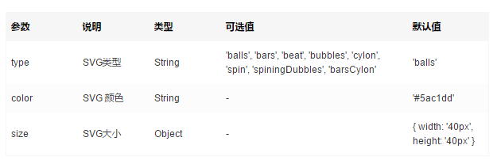

# vue-loading-template

--- 

Use SVG for loading.

demo: https://jkchao.github.io/vue-loading/

## Start

```javascript

  npm install vue-loading-template --save

```

## Options



## Example in SPA

```javascript
 <template>
    <h2>bars</h2>
    <vue-loading type="bars" color="#d9544e" :size="{ width: '50px', height: '50px' }"><vue-loading>
 <template>
  <script>
  import vueLoading from './components/loading.vue'
  export default {
    name: 'app',
    components: {
      vueLoading
    }
  }
  </script>
```


